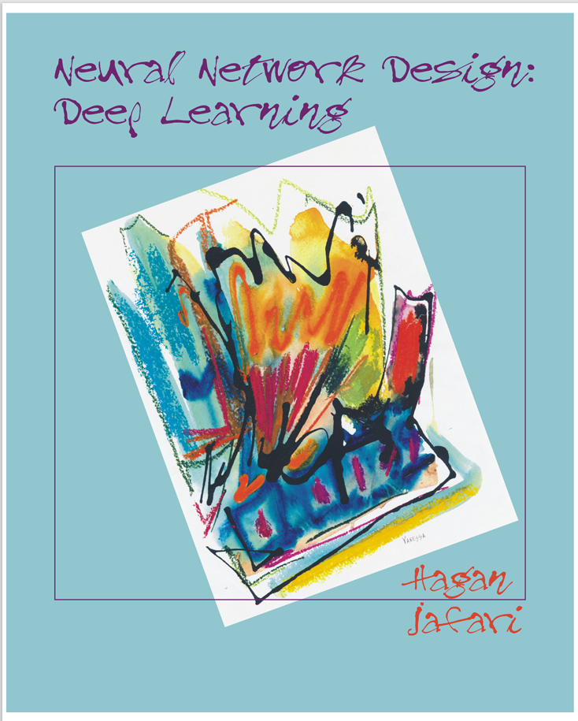

# NEURAL NETWORK DESIGN: DEEP LEARNING

1. Introduction
   
   - Objective
   - What is Deep Learning ?
   - History
   - Applications
     - AlphaFold
     - Large Language Models
     - GANs and Diffusion for Image Generation
     - Speech Generation and Recognition
   - Further Reading 

2. Multilayer Networks

    - Objective 
    - Theory and Examples
        - Architecture 
        - Operation 
        - Deep Networks 
    - Epilogue
    - Further Reading
    - Summary of Results
    - Solved Problems 
    - Exercises 

3. Multilayer Network Training
    
   - Objective 
   - Theory and Example 
        - Performance Index
        - Optimizing Performance - Gradient Descent
        - Variations on Gradient Descent - Adam
        - Computing the Gradient 
   - Epilogue 
   - Further Reading
   - Summary of Results
   - Solved Problems
   - Exercises

4. Supplemental Training Procedures
   
   - Objective 
   - Theory and Example 
        - Speeding Up Convergence
        - Generalization
   - Epilogue 
   - Further Reading
   - Summary of Results
   - Solved Problems
   - Exercises

5. Python

   - Objective 
   - Theory and Example 
     - Python
     - NumPy
     - Pandas
   - Epilogue 
   - Further Reading
   - Labs

6. Tensorflow Intro
   
   - Objective 
   - Theory and Example 
     - Loading the Data
     - Constructing the Model
     - Training the Network 
     - Advanced Data Loading 
   - Epilogue 
   - Further Reading
   - Labs

7. General Modular Network Notation

   - Objective 
   - Theory and Example 
     - Definition of a Layer 
     - Multilayer Perceptron
     - Layered Feedforward Network
     - Dynamic Networks
     - Gradient Calculation for GLFNN
   - Epilogue 
   - Further Reading
   - Summary of Results
   - Solved Problems
   - Exercises 

8. Convolution
   
   - Objective 
   - Theory and Example 
     - Why Use Convolution ? 
     - Details of the Convolution Operation 
     - Template Matching-Matched Filter
     - Hierarchical Template Matching
     - Gradient Calculation  
   - Epilogue 
   - Further Reading
   - Summary of Results
   - Solved Problems
   - Exercises

9. Post Training Analysis
   
   - Objective 
   - Theory and Example 
     - What is Explainability ?
     - Some Definitions of Explainability
     - Illustrative Examples
     - Notation and General Explainability Definitions
     - Linearized Model Methods
     - Contribution Propagation Methods
   - Epilogue 
   - Further Reading
   - Summary of Results
   - Solved Problems
   - Exercises

10. PyTorch Intro
   
   - Objective 
   - Theory and Example 
     - Loading the Data
     - Constructing the Model
     - Training the Network
     - Advanced Data Loading
   - Epilogue 
   - Further Reading
   - Labs

11. Linear Sequence Processing
  
   - Objective 
   - Theory and Example 
     - What are sequences?
     - Dynamics systems?
     - Differences between static and dynamic problems
     - Example: Sequence averaging 
     - Impulse response and convolution 
     - Infinite impulse response systems
     - State space models
   - Epilogue 
   - Further Reading
   - Summary of Results
   - Solved Problems
   - Exercises

12. Nonlinear Sequence Processing
   
   - Objective 
   - Theory and Examples
     - Extending Linear Models to Nonlinear Models
     - Dynamic Backpropagation
     - Learning Long Term Dependencies
     - The Long Short Term Memory (LSTM) Network 
   - Epilogue 
   - Further Reading
   - Summary of Results
   - Solved Problems
   - Exercises

13. Sequence-to-Sequence and Attention

   - Objective 
   - Theory and Example 
     - Basic Seq2Seq Model
     - Attention
     - Self-Attention
     - Input Embedding
     - Positional Encoding
     - Full Decoder-Only Transformer
   - Epilogue 
   - Further Reading
   - Summary of Results
   - Solved Problems
   - Exercises 

---

---